# 🎵 do-sad-people-listen-to-sad-music

우울감이 심해지면 Classical이나 Lo-fi처럼 잔잔한 음악으로 도피할 것이라는 가설을 출발점으로,
음악 청취 습관과 우울 수준의 관계를 설문 데이터로 검증한 프로젝트입니다.

결론적으로는 기대와 반대로, 우울 수준이 높아질수록 Rock과 Metal 같은 자극적인 장르의 청취가 늘어났고,
Classical과 Lo-fi는 우울 수준과 거의 관계가 없었습니다.

이 프로젝트는 단순히 상관계수를 확인하는 수준이 아니라, 그룹 비교, 회귀, 분류, 변수 선택, 군집분석까지 이어서
우울과 음악 취향의 관계가 어떤 방식으로 나타나는지 여러 각도에서 확인한 분석입니다.

## 한 줄 결론
- 초기 가설: 우울이 심해질수록 조용한 음악으로 도피한다
- 관찰 결과: 우울이 높을수록 Rock·Metal 청취가 증가한다
- 해석: 음악은 회피 수단보다 감정 표출 수단에 더 가깝게 작동했다
- 핵심 반전: Classical과 Lo-fi는 기대만큼 우울과 연결되지 않았다

## 데이터
- **출처**: Kaggle MxMH (Music & Mental Health) Survey
- **링크**: https://www.kaggle.com/datasets/catherinerasgaitis/mxmh-survey-results
- **수집**: 2022년 Catherine Rasgaitis
- **규모**: 원본 736명 → 전처리 후 726명
- **구성**: 음악 청취 습관(16개 장르 빈도, BPM, 청취 시간) + 정신건강 지표(Anxiety, Depression, Insomnia, OCD, 0~10점)
- **파생 변수**: HeavyMusic(Rock+Metal), Avoidance_Score(Classical+Lo-fi), Approach_Score(Rock+Metal+Hip-hop)
- **분석 단위**: 응답자 1명당 1행으로 정리된 교차분석용 구조

전처리에서는 결측치를 정리하고, 우울 점수를 기준으로 Low/Mid/High 3개 그룹으로 나눴습니다.
또한 설명력을 높이기 위해 Rock과 Metal을 합친 HeavyMusic, Classical과 Lo-fi를 합친 Avoidance_Score,
Rock·Metal·Hip-hop을 묶은 Approach_Score 같은 파생 지표를 만들었습니다.

## 분석 흐름
| 단계 | 내용 |
|------|------|
| EDA | 기술통계, 분포 확인, 상관관계 히트맵, 우울 그룹별 차이 탐색 |
| 가설 검정 | 우울 그룹(Low/Mid/High) 간 음악 변수 차이 검정(ANOVA) |
| 회귀 분석 | 선형 / 다항(degree 1~4) / Natural Spline 비교 |
| 예측 모델 | Logistic, LDA, QDA, Decision Tree, Random Forest, KNN의 5-Fold CV 비교 |
| 변수 선택 | Lasso 정규화, Random Forest Feature Importance |
| 비지도 학습 | PCA, K-Means(K=2,3,4), 계층적 군집분석 |

분석의 순서는 의도적으로 단순한 통계 요약에서 시작해, 점점 더 복잡한 모델로 확장되도록 구성했습니다.
먼저 패턴을 눈으로 확인하고, 그다음 통계적으로 차이를 검정한 뒤, 예측과 군집화를 통해 구조를 넓게 살폈습니다.

## 주요 결과
- 우울 수준이 높아질수록 Rock·Metal 청취가 증가했다(F=11.790, p<0.001).
- Classical·Lo-fi는 우울 수준과 거의 무관했다(p=0.434). 초기 도피 가설은 기각됐다.
- HeavyMusic과 Depression의 상관계수는 0.212였고, Avoidance_Score와 Depression의 상관계수는 0.022였다.
- Lasso는 Hours per day, Rock, Rap, Metal만 선택했고, 모두 양의 계수를 가졌다.
- Random Forest의 feature importance에서 BPM이 1위(0.114)였다.
- 예측 모델 중 Random Forest가 가장 안정적이었다(CV 0.653, Test 0.648).

수치만 보면 전체 정확도는 0.62~0.66 수준으로 아주 높지는 않지만, 음악 변수만으로도 랜덤 추정보다 나은 수준의 예측력은 확인되었습니다.
즉, 음악 취향은 우울을 완전히 설명하지는 못하지만, 분명히 의미 있는 신호를 포함하고 있습니다.

## 세부 해석
### 1. EDA에서 보인 패턴
평균 Depression은 4.80점이었고, 고우울 그룹(7점 이상)은 전체의 34.7%인 252명이었습니다.
Anxiety 평균이 Depression보다 더 높아, 응답자들은 우울보다 불안을 더 강하게 경험하는 경향도 보였습니다.

### 2. 그룹 비교에서 확인한 차이
우울 그룹이 올라갈수록 HeavyMusic과 청취 시간은 유의미하게 증가했지만, Avoidance_Score와 BPM은 그룹 간 차이가 뚜렷하지 않았습니다.
즉, 우울 수준은 음악을 듣는 양과 자극성에는 영향을 줬지만, 빠르기 선호 자체를 크게 바꾸지는 않았습니다.

### 3. 회귀 분석에서 확인한 한계
Depression을 단독으로 넣은 선형회귀에서는 HeavyMusic 설명력이 낮았고(R²≈0.045),
다중회귀로 Hours per day와 BPM을 더했을 때 설명력이 개선되었지만(R²≈0.081) 여전히 제한적이었습니다.
Natural Spline도 R²=0.050 수준에 머물러, 한 개 변수만으로는 관계를 충분히 포착하기 어렵다는 점을 보여줬습니다.

## 시각화
### EDA
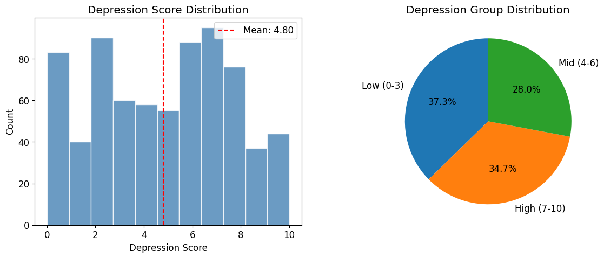

왼쪽은 우울 점수의 전체 분포, 오른쪽은 우울 그룹 비율입니다.
우울 점수는 0~10점 전 구간에 걸쳐 퍼져 있고, 고우울군이 적지 않은 비율을 차지해 후속 분석의 의미가 분명해집니다.

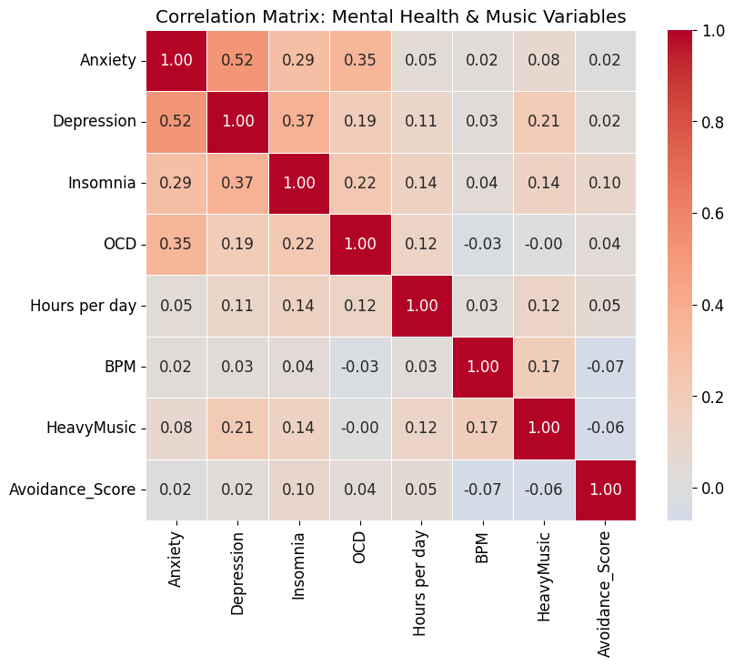

정신건강 지표와 음악 변수의 상관구조를 한 장으로 묶은 그림입니다.
HeavyMusic은 Depression과 양의 상관을 보이고, Avoidance_Score는 거의 0에 가까운 관계를 보여 초기 가설을 약하게 만듭니다.

### 우울 그룹별 차이
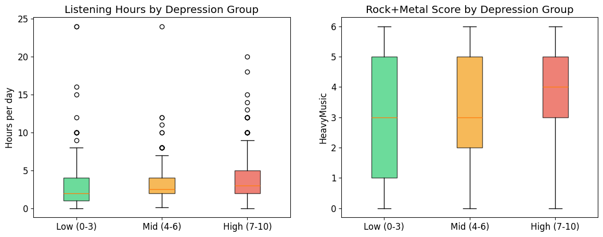

Low, Mid, High 그룹을 직접 비교한 박스플롯입니다.
우울이 높아질수록 Rock·Metal 성향과 청취 시간이 증가하는 방향이 눈에 보이며, 그룹 간 차이를 ANOVA로 검정할 근거를 제공합니다.

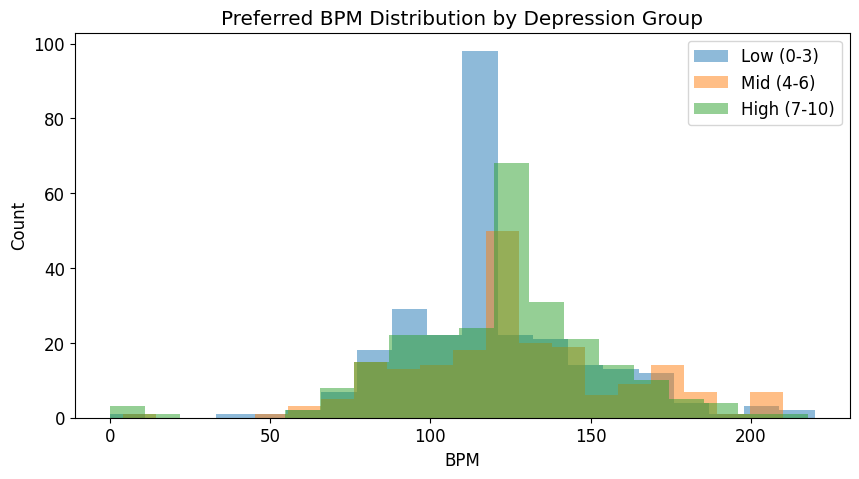

그룹별 BPM 히스토그램은 서로 꽤 겹칩니다.
이 결과는 우울 수준이 음악의 빠르기 자체를 크게 바꾸는 신호는 아니었다는 해석과 맞닿아 있습니다.

### 핵심 장르 변화
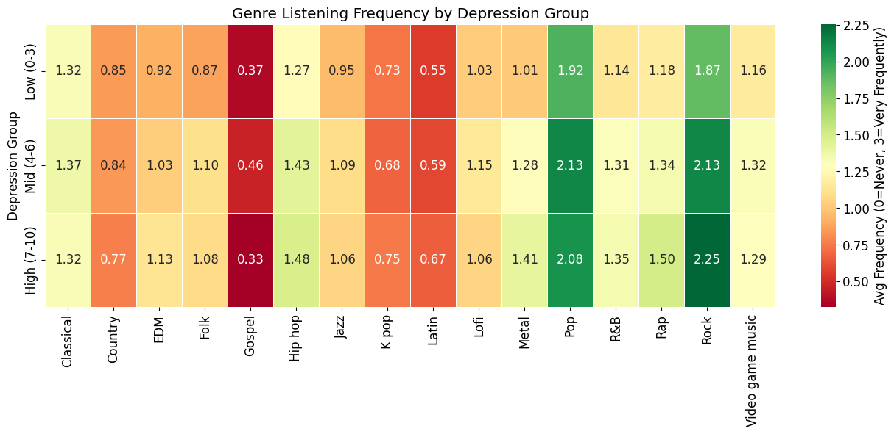

장르별 평균 청취 빈도를 우울 그룹별로 비교한 핵심 그림입니다.
Rock과 Metal은 High 그룹으로 갈수록 상승하지만, Classical과 Lo-fi는 거의 평평하게 유지됩니다.

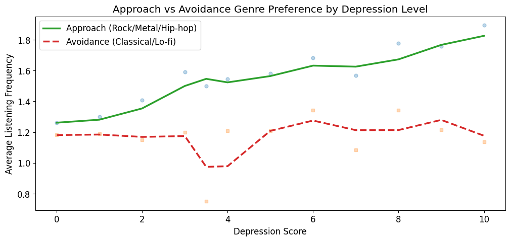

Approach 계열과 Avoidance 계열을 우울 점수 전체 범위에서 추적한 그림입니다.
Approach 계열은 우울이 높아질수록 조금씩 증가하지만, Avoidance 계열은 뚜렷한 상승 신호가 약합니다.

### 회귀 분석
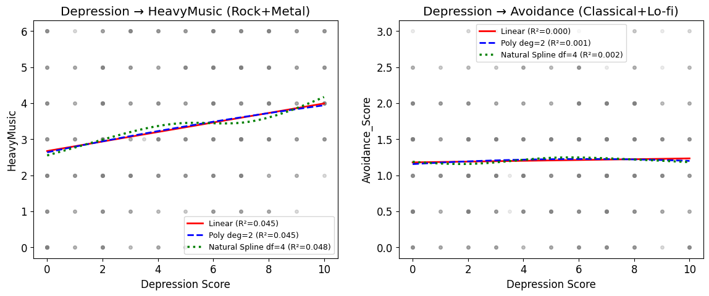

HeavyMusic과 Depression의 관계를 선형, 2차 다항, Natural Spline으로 비교한 그림입니다.
곡선을 더 복잡하게 만들어도 설명력이 크게 개선되지 않아, 관계가 단일 비선형 곡선으로 깔끔하게 정리되지는 않음을 보여줍니다.

### 변수 선택과 예측
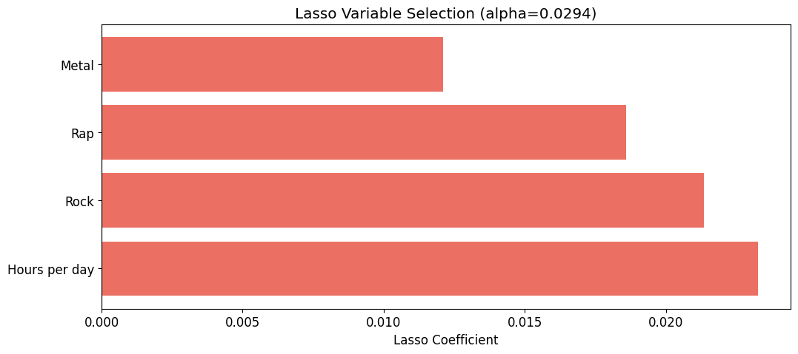

Lasso가 살아남긴 변수들을 보여줍니다.
21개 음악 변수 중 4개만 남았고, 모두 우울 고위험군과 같은 방향의 신호를 보였습니다.

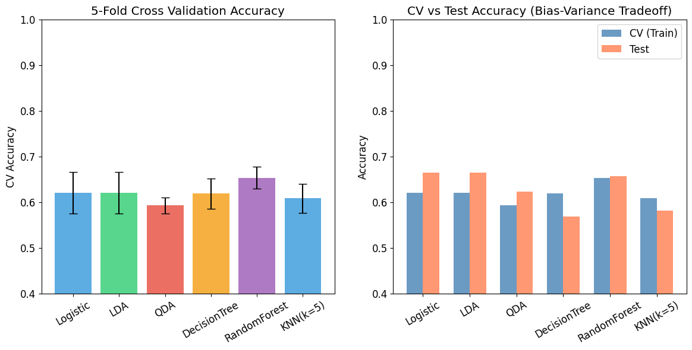

모델별 교차검증 평균과 테스트 정확도를 나란히 비교한 그림입니다.
Random Forest가 가장 안정적이었고, Decision Tree는 CV와 Test 간 차이가 커 과적합 경향이 보였습니다.

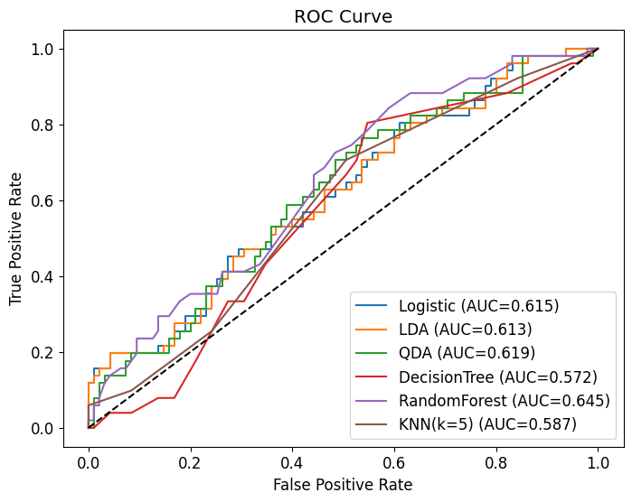

ROC 곡선은 단순 정확도보다 더 균형 있게 모델을 평가합니다.
특히 Random Forest가 가장 좋은 곡선을 보였고, 임계값을 조정하면 F1-score를 더 끌어올릴 수 있었습니다.

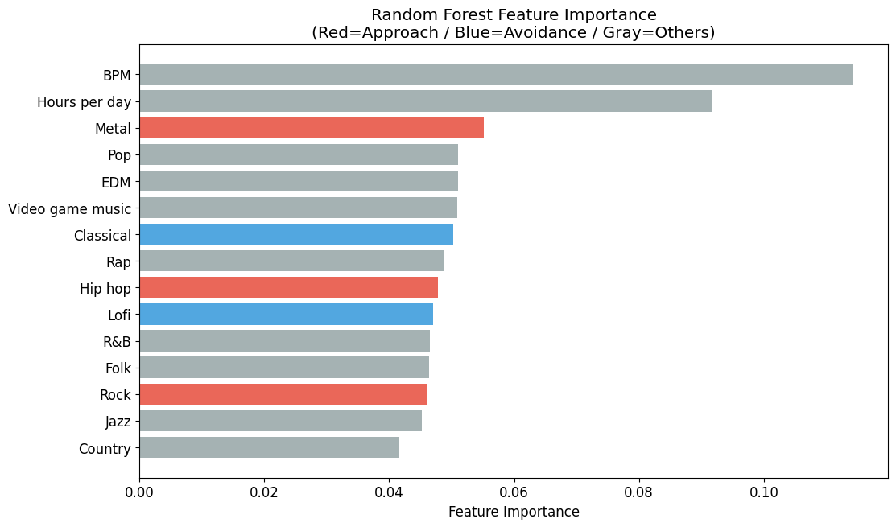

BPM, 청취 시간, Metal 등이 상위권에 올랐습니다.
장르 이름 자체보다 빠르기와 청취 강도가 더 중요한 예측 신호였다는 점이 핵심입니다.

### 비지도 학습
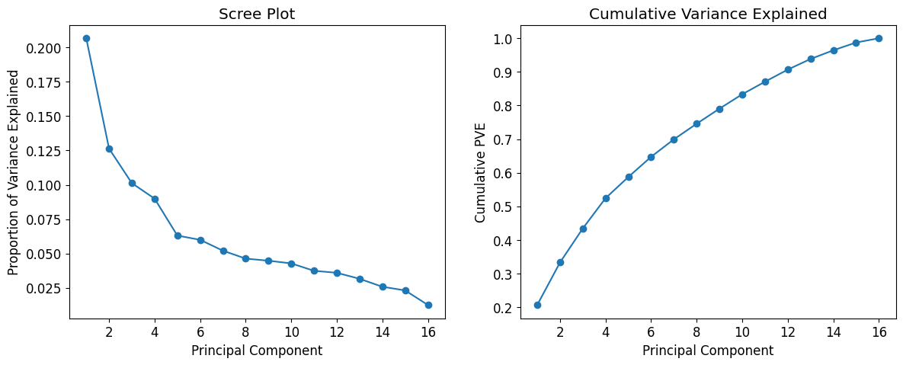

장르 변수의 분산이 몇 개의 주성분에 얼마나 모이는지 확인한 그림입니다.
주성분 수를 줄여도 일정 부분의 구조를 유지할 수 있어, 차원 축소의 타당성을 보여줍니다.

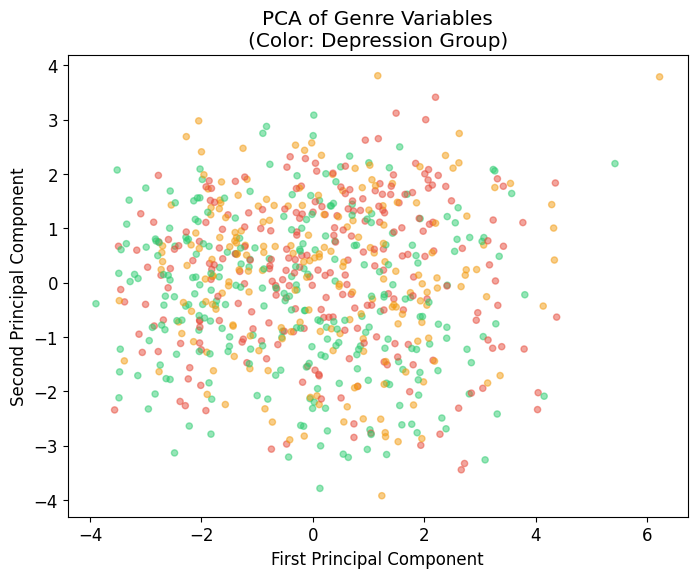

응답자들을 첫 두 주성분 평면에 놓아본 결과입니다.
그룹이 완전히 갈라지지는 않지만 High 그룹이 특정 방향에 조금 더 모이는 패턴이 보입니다.

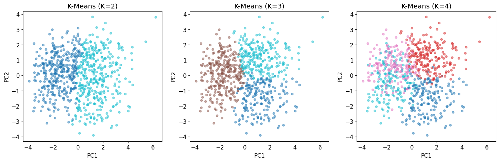

K=2, 3, 4를 비교해 군집 경계가 어떻게 달라지는지 확인한 그림입니다.
K=3일 때 군집별 정신건강 평균의 차이가 가장 해석하기 좋았습니다.

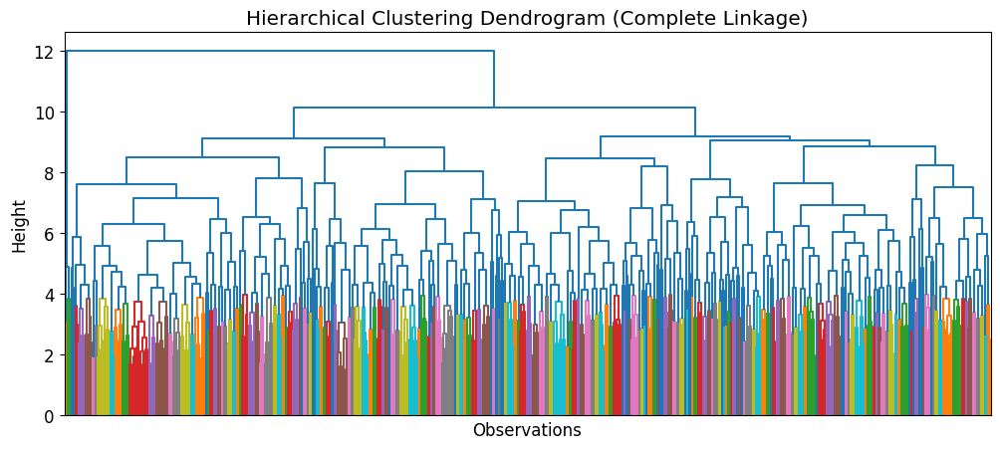

계층적 군집분석은 군집 수를 미리 고정하지 않고 응답자 간 거리를 단계적으로 묶습니다.
덴드로그램 절단 높이에 따라 다른 군집 구조를 볼 수 있어, K-Means와 다른 관점에서 패턴을 확인할 수 있습니다.

## 사용 라이브러리
```python
import statsmodels.api as sm
from ISLP.models import ModelSpec as MS, summarize, poly, ns
from ISLP import confusion_table
from ISLP.cluster import compute_linkage
import sklearn.linear_model as skl
import sklearn.model_selection as skm
```

## 파일 구성
```
├── README.md
├── sad_music_analysis (1).ipynb
└── assets/
	├── cell_011_01.png
	├── cell_013_01.png
	└── ...
```
